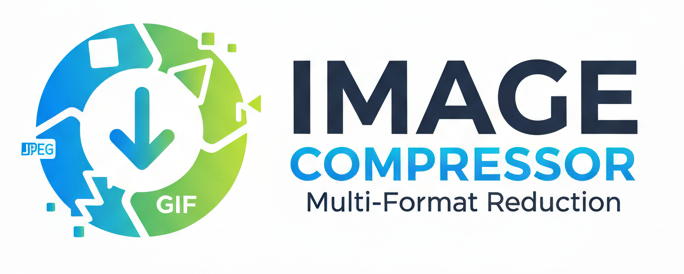

# 🎨 Brand Guidelines - Image Compressor

## Logo

The official logo is located at `/public/logo.png`



### Logo Usage
- **Primary:** Use the full logo with circular icon and text
- **Size:** Minimum height of 40px for readability
- **Clear Space:** Maintain at least 12px of clear space around the logo
- **Background:** Works best on white or light backgrounds

---

## Color Palette

### Primary Colors

#### Brand Blue
- **Hex:** `#00A0DC`
- **RGB:** `rgb(0, 160, 220)`
- **Usage:** Primary buttons, links, headings, CTAs
- **Hover State:** `#0080B0` (Darker blue)

```css
/* Primary Button */
background: #00A0DC;

/* Hover */
background: #0080B0;
```

#### Brand Green
- **Hex:** `#7AC943`
- **RGB:** `rgb(122, 201, 67)`
- **Usage:** Success states, compressed results, accents
- **Hover State:** `#68B030` (Darker green)

```css
/* Success/Green accent */
background: #7AC943;

/* Hover */
background: #68B030;
```

### Secondary Colors

#### Dark Navy
- **Hex:** `#2C3E50`
- **RGB:** `rgb(44, 62, 80)`
- **Usage:** Dark text, headings

#### Light Blue Background
- **Hex:** `#EBF8FF` (blue-50)
- **Usage:** Background tints, light sections

#### Light Green Background
- **Hex:** `#F0FDF4` (green-50)
- **Usage:** Success messages, compressed image highlights

### Neutral Colors

#### Gray Scale
- **Gray-900:** `#111827` - Primary text
- **Gray-600:** `#4B5563` - Secondary text
- **Gray-500:** `#6B7280` - Tertiary text
- **Gray-200:** `#E5E7EB` - Borders
- **Gray-50:** `#F9FAFB` - Light backgrounds

---

## Typography

### Fonts
- **Primary:** Geist Sans
- **Monospace:** Geist Mono

### Type Scale
```css
/* Headers */
h1: 2xl-5xl (24px-48px) - Bold
h2: xl-3xl (20px-30px) - Bold
h3: lg-2xl (18px-24px) - Semibold

/* Body */
Body Large: text-xl (20px)
Body: text-base (16px)
Body Small: text-sm (14px)
Caption: text-xs (12px)
```

---

## UI Components

### Buttons

#### Primary Button (Blue)
```tsx
className="bg-[#00A0DC] text-white px-4 py-2 rounded-lg hover:bg-[#0080B0] transition-colors"
```

#### Success Button (Green)
```tsx
className="bg-[#7AC943] text-white px-4 py-2 rounded-lg hover:bg-[#68B030] transition-colors"
```

#### Secondary Button
```tsx
className="bg-white border-2 border-gray-300 text-gray-700 px-4 py-2 rounded-lg hover:bg-gray-50"
```

### Cards

#### Default Card
```tsx
className="bg-white border border-gray-200 rounded-lg p-6"
```

#### Primary Card (Blue)
```tsx
className="bg-gradient-to-br from-blue-50 to-blue-100 border border-[#00A0DC] rounded-lg p-6"
```

#### Success Card (Green)
```tsx
className="bg-green-50 border border-[#7AC943] rounded-lg p-6"
```

### Form Elements

#### Input Field
```tsx
className="w-full px-4 py-3 border border-gray-300 rounded-lg focus:ring-2 focus:ring-[#00A0DC] focus:border-[#00A0DC]"
```

#### Range Slider
- **Track Progress:** `#00A0DC` (Blue)
- **Track Background:** `#E5E7EB` (Gray-200)
- **Thumb:** Gradient from Blue to Green `linear-gradient(135deg, #00A0DC, #7AC943)`

---

## Gradients

### Blue Gradient
```css
background: linear-gradient(to right, #00A0DC, #0080B0);
```

### Green Gradient
```css
background: linear-gradient(to right, #7AC943, #68B030);
```

### Blue-Green Gradient (Slider thumb)
```css
background: linear-gradient(135deg, #00A0DC, #7AC943);
```

### Background Gradients
```css
/* Login/Profile page */
background: linear-gradient(to bottom right, from blue-50, to white);
```

---

## Iconography

### Style
- **Primary:** Use emoji icons for friendly feel
- **Functional:** SVG icons for UI elements (outlined style)
- **Size:** 20px-24px for UI icons, larger for feature icons

### Common Icons
- **Upload:** 📁
- **Success:** 🎉 or ✓
- **Profile:** 👤
- **Download:** ⬇️ SVG

---

## Brand Voice

### Tone
- **Friendly** but professional
- **Clear** and straightforward
- **Helpful** and encouraging

### Example Copy
✅ Good: "Compression Complete! Your image has been optimized and is ready to download."  
❌ Avoid: "Image successfully compressed."

---

## Applications

### Header
```tsx
<header className="bg-white border-b border-gray-200">
  
</header>
```

### Primary CTA
```tsx
<button className="bg-[#00A0DC] hover:bg-[#0080B0]">
  Compress Image
</button>
```

### Success Message
```tsx
<div className="bg-blue-50 border border-[#00A0DC]">
  <h3 className="text-[#00A0DC]">Compression Complete!</h3>
</div>
```

### Compression Result
```tsx
<div className="border-[#7AC943]">
  <p className="text-[#7AC943]">Compressed Size</p>
</div>
```

---

## Accessibility

### Color Contrast
- **Blue (#00A0DC) on White:** 4.52:1 ✅ (AA compliant)
- **Green (#7AC943) on White:** 2.84:1 ⚠️ (Use for non-critical text only)
- **Navy (#2C3E50) on White:** 12.67:1 ✅ (AAA compliant)

### Recommendations
- Use Navy (#2C3E50) for body text
- Use Blue (#00A0DC) for headings and buttons
- Use Green (#7AC943) for decorative elements and large text only
- Ensure sufficient contrast for all interactive elements

---

## Usage Examples

### Page Header
```tsx

```

### Hero Section
```tsx
<h1 className="text-[#2C3E50]">
  Smart <span className="text-[#00A0DC]">WebP</span> Compression
</h1>
```

### Stats Card
```tsx
<div className="bg-gradient-to-br from-blue-50 to-blue-100 border border-[#00A0DC]">
  <p className="text-[#0080B0]">Total Images</p>
  <p className="text-[#00A0DC]">42</p>
</div>
```

---

## Don'ts

❌ Don't use the old emerald green color (#059669)  
❌ Don't alter the logo colors  
❌ Don't stretch or distort the logo  
❌ Don't use low contrast text  
❌ Don't mix old and new brand colors  

---

## Brand Updates

**Previous Brand:** Emerald Green (#059669) with Panda emoji 🐼  
**Current Brand:** Blue (#00A0DC) and Green (#7AC943) with official logo  
**Updated:** January 13, 2026

---

**Brand Version:** 2.0  
**Last Updated:** January 13, 2026
